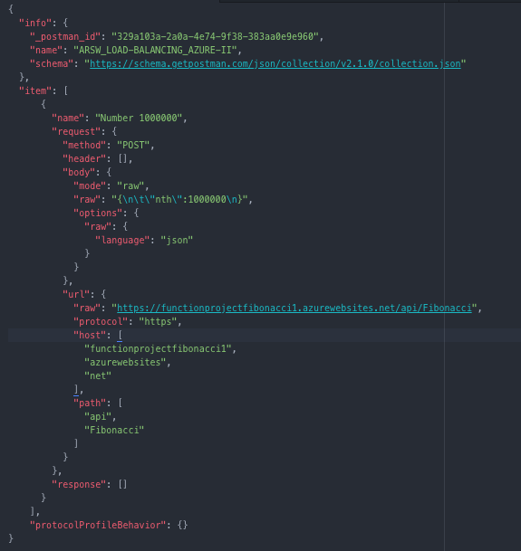

### Escuela Colombiana de Ingeniería
### Arquitecturas de Software - ARSW

## Integrantes
* Carlos Castañeda
* Luis Jaramillo
* Fernando Barrera

## Escalamiento en Azure con Maquinas Virtuales, Sacale Sets y Service Plans

### Dependencias
* Cree una cuenta gratuita dentro de Azure. Para hacerlo puede guiarse de esta [documentación](https://azure.microsoft.com/en-us/free/search/?&ef_id=Cj0KCQiA2ITuBRDkARIsAMK9Q7MuvuTqIfK15LWfaM7bLL_QsBbC5XhJJezUbcfx-qAnfPjH568chTMaAkAsEALw_wcB:G:s&OCID=AID2000068_SEM_alOkB9ZE&MarinID=alOkB9ZE_368060503322_%2Bazure_b_c__79187603991_kwd-23159435208&lnkd=Google_Azure_Brand&dclid=CjgKEAiA2ITuBRDchty8lqPlzS4SJAC3x4k1mAxU7XNhWdOSESfffUnMNjLWcAIuikQnj3C4U8xRG_D_BwE). Al hacerlo usted contará con $200 USD para gastar durante 1 mes.

### Parte 0 - Entendiendo el escenario de calidad

Adjunto a este laboratorio usted podrá encontrar una aplicación totalmente desarrollada que tiene como objetivo calcular el enésimo valor de la secuencia de Fibonnaci.

**Escalabilidad**
Cuando un conjunto de usuarios consulta un enésimo número (superior a 1000000) de la secuencia de Fibonacci de forma concurrente y el sistema se encuentra bajo condiciones normales de operación, todas las peticiones deben ser respondidas y el consumo de CPU del sistema no puede superar el 70%.

### Escalabilidad Serverless (Functions)

1. Cree una Function App tal cual como se muestra en las  imagenes.

2. Instale la extensión de **Azure Functions** para Visual Studio Code.

3. Despliegue la Function de Fibonacci a Azure usando Visual Studio Code. La primera vez que lo haga se le va a pedir autenticarse, siga las instrucciones.

4. Dirijase al portal de Azure y pruebe la function.

5. Modifique la coleción de POSTMAN con NEWMAN de tal forma que pueda enviar 10 peticiones concurrentes. Verifique los resultados y presente un informe.

6. Cree una nueva Function que resuleva el problema de Fibonacci pero esta vez utilice un enfoque recursivo con memoization. Pruebe la función varias veces, después no haga nada por al menos 5 minutos. Pruebe la función de nuevo con los valores anteriores. ¿Cuál es el comportamiento?.

## Preguntas

* ¿Qué es un Azure Function?

Azure Functions es un servicio de cómputo sin servidor que le permite ejecutar código activado por eventos sin tener que aprovisionar o administrar explícitamente la infraestructura.

* ¿Qué es serverless?

Serverless es un modelo de ejecución en el que el proveedor en la nube es responsable de ejecutar un fragmento de código mediante la asignación dinámica de los recursos. Y cobrando solo por la cantidad de recursos utilizados para ejecutar el código. 

* ¿Qué es el runtime y que implica seleccionarlo al momento de crear el Function App?

Todas las funciones en una aplicación de funciones deben compartir el mismo idioma. Cuando crea una aplicación de función, debe elegir una pila de tiempo de ejecución para la aplicación. La pila de tiempo de ejecución se especifica por el FUNCTIONS_WORKER_RUNTIME valor en la configuración de la aplicación. Este requisito se agregó para mejorar la huella y el tiempo de inicio. 

* ¿Por qué es necesario crear un Storage Account de la mano de un Function App?

Contiene todos sus objetos de datos de Azure Storage: blobs, archivos, colas, tablas y discos. La cuenta de almacenamiento proporciona un espacio de nombres único para sus datos de Azure Storage al que se puede acceder desde cualquier lugar del mundo a través de HTTP o HTTPS.

* ¿Cuáles son los tipos de planes para un Function App?, ¿En qué se diferencias?, mencione ventajas y desventajas de cada uno de ellos.

**Plan de consumo**: Azure proporciona todos los recursos de cálculo necesarios. No tiene que preocuparse de la administración de recursos y solo paga por el tiempo que haya empleado en la ejecución del código.
 
**Plan Premium**: especifique un número de instancias activadas previamente que siempre están en línea y preparadas para responder de inmediato. Cuando se ejecuta la función, Azure proporciona todos los recursos informáticos adicionales que sean necesarios. Se paga tanto por las instancias activadas previamente que se ejecutan de forma continua como por todas las instancias adicionales que se usen cuando Azure reduce y escala horizontalmente la aplicación.

**Plan de App Service**: se ejecutan las funciones igual que aplicaciones web. Si ya usa App Service para las otras aplicaciones, las funciones pueden ejecutarse en el mismo plan sin costo adicional.

* ¿Por qué la memorización falla o no funciona de forma correcta?

Por que al ejecutar la aplicación se excede el límite de recusión, esto sucede cuando operamos un numero muy grande como lo es 1000000. 

* ¿Cómo funciona el sistema de facturación de las Function App?

El sistema de facturación de las Function App estan dadas por la cantidad de ejecuciones, el runtime y la memoria utilizada para la aplicación.

## Informe

* 10 peticiones con Fibonacci recursivo.

* Como resultado se obtuvo un promedio en tiempo de 1m 58.9 s en responder cada petición y un tiempo total de 19m 49s.

